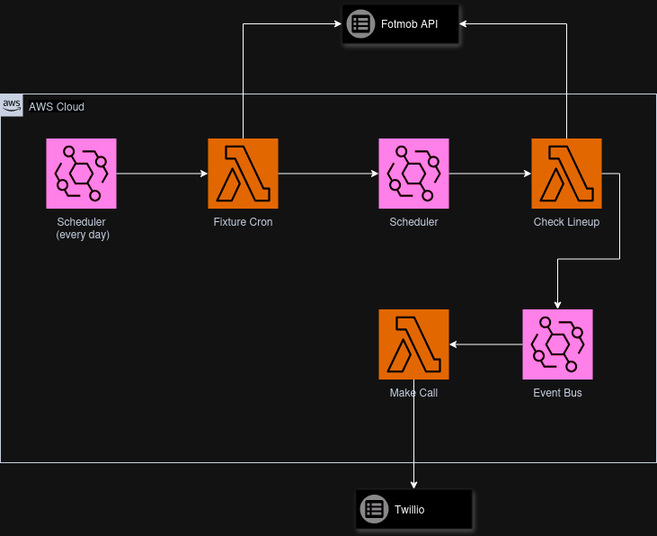

# Bolton Match Lineup Bot

This is a personal project to send a text of the bolton lineup for home games.

## But Why?

The signal is awful at the stadium so to prevent my brother from ringing me at 2pm to get the lineup.
So I built this to actually enjoy my Saturdays in peace

## How does it work?

There are 3 different lambda functions:
- fixture-cron
- check-lineup
- make-call

The Fixture Cron runs every day in the morning and checks FotMob if a Bolton game is scheduled.
If so it creates a record of the match ID in DyanmoDB and a schedule in event bridge to run 1 hour before kickoff.
This schedule will call the Check Lineup lambda every minute for 15 minutes.

The Check Lineup lambda does as it suggests, when called by the schedule, it takes the match ID will check if the lineups have been set.
If not, it will do nothing to be called again in a minute. If the lineup is present, it will store it in DynamoDB and put a `Lineup Set` event onto the event bus

The final lambda, Make Call, listens for the `Lineup Set` event and will send a text via Twilio. (I should rename it at some point)
